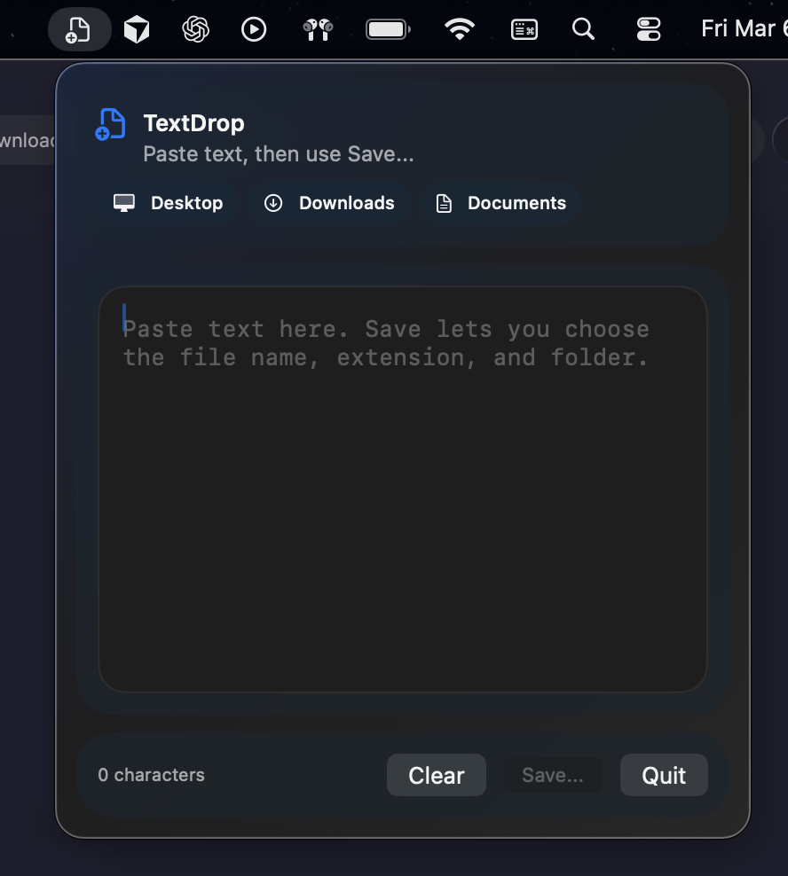

# TextDrop

TextDrop is a menu bar macOS app for one job: paste text into an editor, then create a new file anywhere inside `Desktop`, `Downloads`, or `Documents`.



## Install

### Homebrew

```bash
brew tap scasella/tap
brew install --cask textdrop
```

### Build From Source

```bash
bash build.sh
open TextDrop.app
```

## Quickstart

1. Launch `TextDrop.app`.
2. Click the menu bar icon.
3. Paste text into the editor.
4. Click `Save...` or press `Cmd+Return`.
5. Choose a folder inside `Desktop`, `Downloads`, or `Documents`.
6. Enter a file name with an extension and save.

## Features

- Menu bar utility with no Dock icon
- Compact editor tuned for quick paste-and-save flows
- `Cmd+Return` keyboard shortcut for the same save flow as the `Save...` button
- Native save dialog for file name, extension, and folder choice
- Save restriction enforced to `Desktop`, `Downloads`, and `Documents`, including subdirectories
- Liquid Glass surfaces on macOS 26 with material fallbacks on earlier runtimes

## Test

```bash
swiftc -DTESTING TextDrop.swift test_textdrop.swift -o /tmp/textdrop-tests
/tmp/textdrop-tests
```

## Requirements

- macOS 26+ for the full Liquid Glass UI
- Swift 6.2+ to build from source

## License

MIT
